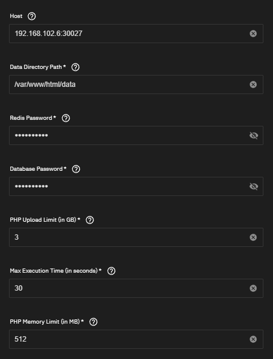
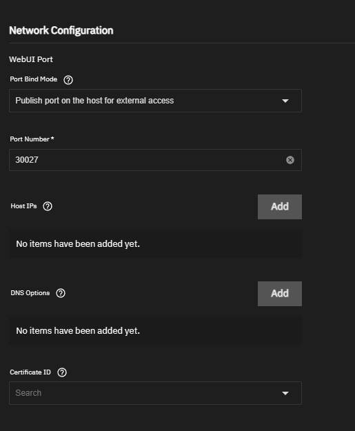
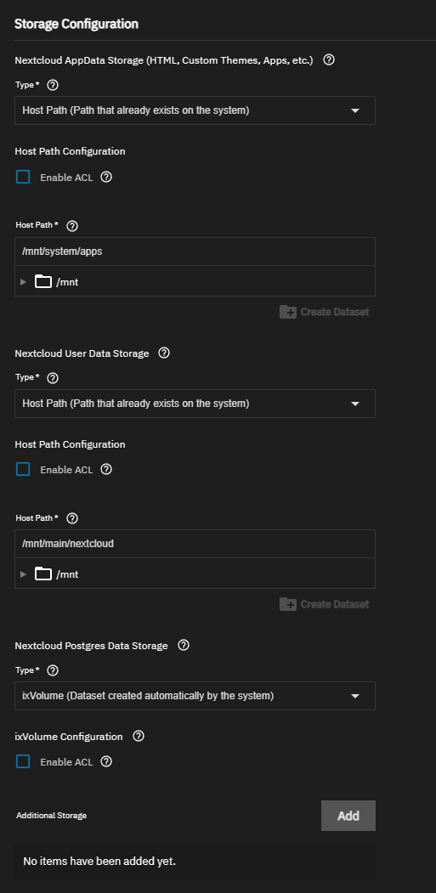
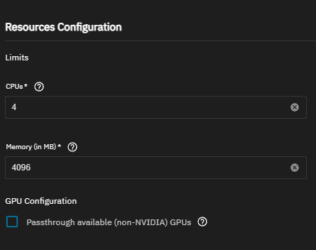

# Nextcloud в TrueNAS Scale — Чек-лист критических настроек

> Инструкция для TrueNAS Scale 24.10+ (Electric Eel) с установкой через Apps → Discover Apps

---

## 1. Nextcloud Configuration

### Обязательные поля

| Параметр                | Что указать                         | Пример                |
| ----------------------- | ----------------------------------- | --------------------- |
| **Timezone**            | Ваш часовой пояс                    | `Europe/Moscow`       |
| **Postgres Image**      | Оставить по умолчанию               | `Postgres 17`         |
| **Admin User**          | Логин администратора Nextcloud      | `ncadmin`             |
| **Admin Password**      | Надёжный пароль                     | `••••••••`            |
| **Host**                | IP вашего TrueNAS + порт            | `192.168.1.100:30027` |
| **Data Directory Path** | Путь внутри контейнера (не менять!) | `/var/www/html/data`  |
| **Redis Password**      | Пароль для Redis                    | `••••••••`            |
| **Database Password**   | Пароль PostgreSQL                   | `••••••••`            |

### ⚠️ Важно про пароли

- **Redis Password** — НЕ использовать символы `& @ # %` (Nextcloud не экранирует их)
- Все пароли запомните — они понадобятся только при пересоздании контейнера

### Опциональные настройки производительности

| Параметр                                  | По умолчанию | Рекомендация                        |
| ----------------------------------------- | ------------ | ----------------------------------- |
| **PHP Upload Limit (GB)**                 | 3            | Увеличить до 10+ для больших файлов |
| **Max Execution Time (sec)**              | 30           | 300 для медленных операций          |
| **PHP Memory Limit (MB)**                 | 512          | 1024 если много пользователей       |
| **Op Cache Interned Strings Buffer (MB)** | 32           | Оставить                            |
| **Op Cache Memory Consumption (MB)**      | 128          | Оставить                            |

Пример указания хоста и PHP:


### Cron

- **Enabled** — рекомендуется включить для фоновых задач (генерация превью, очистка)
- Если не включить, Nextcloud будет использовать AJAX-крон (менее надёжно)

---

## 2. Network Configuration

| Параметр           | Значение                                       | Комментарий                                     |
| ------------------ | ---------------------------------------------- | ----------------------------------------------- |
| **Port Bind Mode** | `Publish port on the host for external access` | Для доступа извне                               |
| **Port Number**    | `30027` (или ваш)                              | Должен совпадать с портом в поле **Host** выше! |
| **Certificate ID** | Пусто или ваш сертификат                       | Для HTTPS (опционально)                         |

Пример Network:


### ⚠️ Частая ошибка

Порт в **Host** (`192.168.1.100:30027`) должен совпадать с **Port Number** в Network Configuration. Если они разные — Nextcloud выдаст ошибку "Access through untrusted domain".

---

## 3. Storage Configuration — САМОЕ ВАЖНОЕ

Неправильные права на хранилище — причина 90% проблем с установкой Nextcloud.

### Три варианта хранилища

| Хранилище                 | Тип                      | Путь                            |
| ------------------------- | ------------------------ | ------------------------------- |
| **AppData Storage**       | Host Path                | `/mnt/pool/apps/nextcloud/html` |
| **User Data Storage**     | Host Path                | `/mnt/pool/data/nextcloud`      |
| **Postgres Data Storage** | ixVolume (рекомендуется) | Автоматически                   |

Пример Storage:


### Вариант А: Простая установка (ixVolume для Postgres)

Если для **Postgres Data Storage** выбрать `ixVolume` — TrueNAS сам создаст датасет с правильными правами. Это самый простой вариант.

**Минус:** данные хранятся в скрытом датасете `ix-apps`, сложнее делать бэкапы вручную.

### Вариант Б: Host Path для всех (полный контроль)

Если хотите хранить всё в своих датасетах:

1. **Создайте датасеты заранее:**

   ```
   /mnt/pool/nextcloud/
   ├── html          (Dataset Preset: Apps)
   ├── data          (Dataset Preset: Apps)
   └── postgres_data (Dataset Preset: Apps, ACL Type: POSIX в Advanced!)
   ```

2. **Права для html и data:**

   - Owner: `apps`
   - Owner Group: `apps`
   - ACL Entry: UID `568` → Full Control

3. **Права для postgres_data:**
   - ⚠️ **НЕ включать Enable ACL!**
   - Выбрать **Automatic Permissions**

### ⚠️ Типичные ошибки Storage

| Симптом                 | Причина                     | Решение                            |
| ----------------------- | --------------------------- | ---------------------------------- |
| Зависает на "Deploying" | Нет прав на датасеты        | Проверить Owner = `apps`           |
| 403 Forbidden           | www-data не имеет доступа   | Добавить UID 568 в ACL             |
| Ошибка netdata          | Enable ACL на postgres_data | Использовать Automatic Permissions |

---

## 4. Resources Configuration

| Параметр        | Минимум | Рекомендация                    |
| --------------- | ------- | ------------------------------- |
| **CPUs**        | 2       | 4 (если богаты)                 |
| **Memory (MB)** | 2048    | 4096–6144 (если ооочень богаты) |
| **GPU**         | —       | Не требуется                    |

Пример Resources:


---

## 5. После установки — первый запуск

1. Дождитесь статуса **Running** (может занять 2-5 минут)
2. Откройте Web UI: `http://IP_TRUENAS:30027`
3. Войдите с логином/паролем из **Admin User** / **Admin Password**

### Возможные предупреждения в Nextcloud

После входа зайдите в **Настройки → Администрирование → Обзор**. Типичные предупреждения:

- "Не настроен регион телефонных номеров" — игнорировать или указать в config.php
- "Cron не выполняется" — включите Cron в настройках приложения

---

## Быстрый чек-лист перед установкой

- [ ] Timezone выбран правильно
- [ ] Admin User и Admin Password заполнены
- [ ] Host содержит IP:порт (например, `192.168.1.100:30027`)
- [ ] Redis Password и Database Password заполнены (без `& @ # %`)
- [ ] Port Number совпадает с портом в Host
- [ ] Storage пути указаны и датасеты существуют
- [ ] Для Postgres: либо ixVolume, либо Host Path + Automatic Permissions

---

_TrueNAS: Scale 24.10+_
